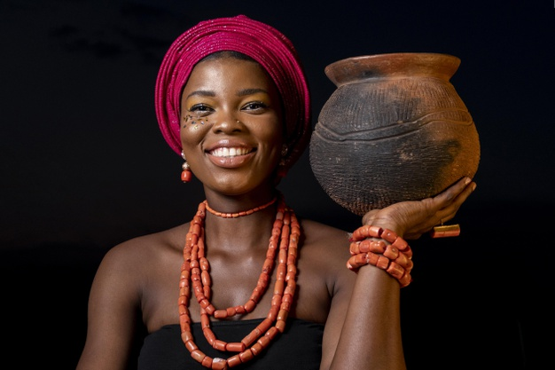

## **THE AKAN FAMILY**




## **Description**
####  Akan, ethnolinguistic grouping of peoples of the Guinea Coast who speak Akan languages (of the Kwa branch of the Niger-Congo family).AKAN,names come from a traditional naming system for people from countries such as Togo, Ivory Coast and Ghana.A child’s name is determined by factors surrounding his or her birth. For example, the day of their birth or the manner in which they were born may determine which name they get irrespective of their gender. 
                  


>  These Akan names signify the day one is born..The table bellow provide a few factors and occurrence that lead to one's naming

| Factor | Name | Gender | M/F |
| ---   |  ---     | ---  | --- |
| On the field  |  Afúom  | - | -
| On the road   |  Ɔkwán  | - | -
| Responsibility   |  Yεmpέw  | - | -
| First born  |  Píèsíe  | Male | 
| Second born | Mǎnu| Male  
|        | Máanu  |    -    | Female
| In war   | Bekṍe | Male  
|        | Bedíàkṍ |    -    | Female
|       |        |       |

## **Contributors**
#### The website was brought to life by : [**Brian Khaifah**](https://moringaschool.com/)


## **Setup/Installation**
* Clone the Repo.
    * ```
          git clone https://github.com/BrianKhaifah/The-Akan-Family..git

      ```
* Open the project on vs code or your desired editor.

* Open the project on live Server.


##  **known Bugs**
#### There are no Bugs, but should you come across feel free share it with me via my,

Personal
[Email](brian.obuom@student.moringaschool.com)

## **Technology Used**
 * HTML

* CSS

* Javascript

* README.md


## **License**

#### Mt [**License**](https://choosealicense.com/licenses/mit/)

Copyright (c) 2021 [BrianKhaifah !](https://briankhaifah.github.io/Brian-s-Portfolio/)


